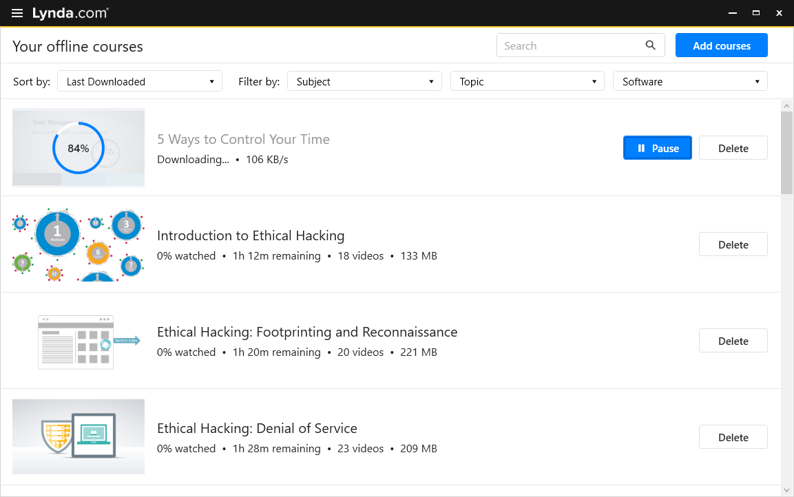
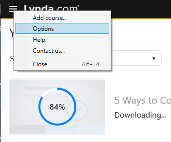
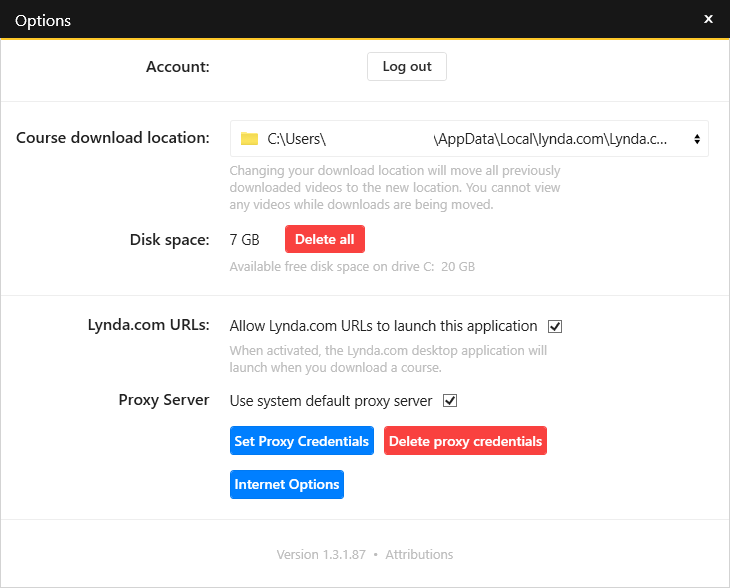
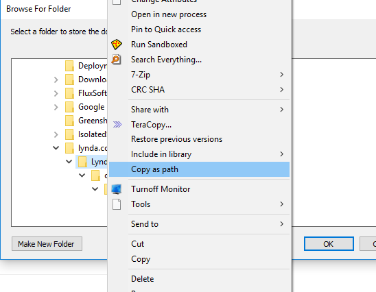

# LynCrypto
LynCrypto is a java application used to decrypt Lynda courses downloaded using their Desktop application.

## Prerequisites
1. `JRE 1.8`
2. `Lynda.com Desktop App` installed
3. Download offline some courses using the lynda app.

## Usage 
1. Determine `Lynda.com Desktop App` save path see the prics :

Now Hold **Shift** while **Right-click** of the `Lynda.com Desktop App Folder`

2. Now Open `config.properties` and make approperiate edits 
3. `OfflineDirectory` is the directory you just copied
4. `SaveAs` is the destination directory to save the courses in.
5. Run `run.bat`

## Features
1. Decrypt lynda courses.
2. Save each course indiviualy to a separate folder.
3. Restore the normal names of Videos/Chapters/Courses

## Limitations
1. Saving all courses.
2. No GUI yet.
